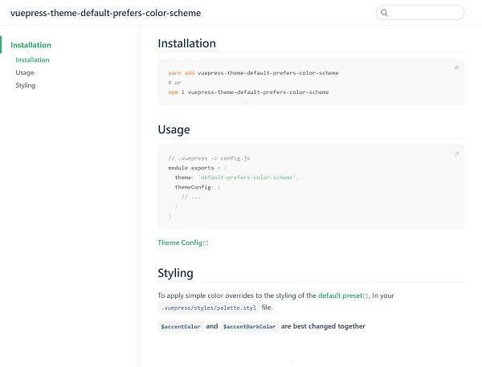
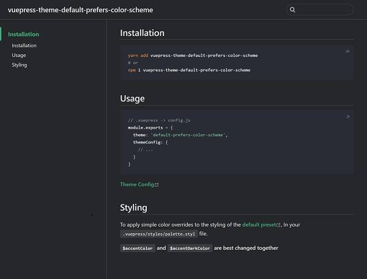

# vuepress-theme-default-prefers-color-scheme

> add prefers-color-scheme for vuepress default theme

[README](README.md) | [CHANGELOG](CHANGELOG.md)

**This theme for Vuepress 1.x**

[Live Demo and Documentation](https://tolking.github.io/vuepress-theme-default-prefers-color-scheme)

---





---

## Installation

``` sh
yarn add vuepress-theme-default-prefers-color-scheme
# or
npm i vuepress-theme-default-prefers-color-scheme
```

## Usage

``` js
// .vuepress -> config.js
module.exports = {
  theme: 'default-prefers-color-scheme',
  themeConfig: {
    // ...
  }
}
```

## Options

### defaultTheme
- Type: `string`, `object`
- Default: `undefined`
- Required: `false`

By default, light or dark themes are displayed by [prefers-color-scheme](https://developer.mozilla.org/en-US/docs/Web/CSS/@media/prefers-color-scheme), You can change it by `defaultTheme`

support `light`, `dark` or `{ theme: [begin hours, end hours] }`

``` js
module.exports = {
  theme: 'default-prefers-color-scheme',
  themeConfig: {
    defaultTheme: 'dark',
    // or
    defaultTheme: { dark: [18, 6] },
    // or
    defaultTheme: { light: [6, 18], dark: [18, 6] },
  },
  // When using `light theme` or `dark theme`, you need to add a postcss plugins to your config.js
  postcss: {
    plugins: [
      require('css-prefers-color-scheme/postcss'),
      require('autoprefixer')
    ]
  }
}
```

[Theme Config](https://v1.vuepress.vuejs.org/theme/default-theme-config.html)

## Styling

To apply simple color overrides to the styling of the [default preset](https://github.com/tolking/vuepress-theme-default-prefers-color-scheme/blob/master/styles/palette.styl), In your `.vuepress/styles/palette.styl` file.

**`$accentColor` and `$accentDarkColor` are best changed together**

## License

[MIT](http://opensource.org/licenses/MIT)

## Keywords

vue vuepress documentation prefers-color-scheme default-theme light-theme dark-theme
